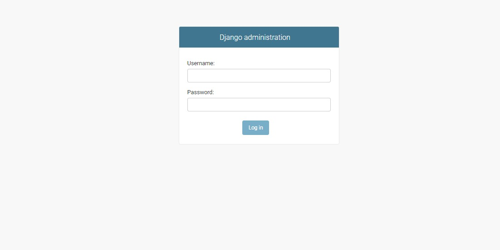

# Day 2 of Webinar on Django : Pyhton web framework

#### Creating *Virtual Environment*

Every project is unique, that uses different libraries and Modules. So we need to have an separate environment where the libraries or Modules required only for that projects is installed and used.
 * Install Virtual environment library to the base python in command prompt.
    > pip3 install virtualenv

* Create virtual environment in the desired directory path in command prompt.
    > virtualenv virtual_env_name

* Activate virtual environment.
    > virtual_env_name\scripts\activate
----
#### Install Django using command
* 
    > pip3 install django
* Verify installation
    > python -m django --version 

#### Create a project
* use the command to create a project
    > django-admin startproject project_name

* A directory or folder with the project name will be created.
* The file structure will be
    ```
    project_name:
    ------------- manage.py
    ------------- Project_name:
                 -------------  __init__.py
                 -------------  asgi.py
                 -------------  settings.py
                 -------------  urls.py
                 -------------  wsgi.py
    ```
#### Running the project in the local server. 
*  Get in to the project folder
    > cd Project_name
*  Run server using command
    >python3 manage.py runserver
    >or
    >python manage.py runserver
* you will see text as shown below in your command prompt
    > Watching for file changes with StatReloader
    Performing system checks...
    >
    > System check identified no issues (0 silenced).
    >
    >You have 17 unapplied migration(s). Your project may not work properly until you apply the migrations for app(s): admin, auth, contenttypes, sessions.
    >
    >Run 'python manage.py migrate' to apply them.
    Month Date, Year - HH:MM:SS
    Django version 2.2.1, using settings 'project_name.settings'
    Starting development server at http://127.0.0.1:8000/
    Quit the server with CTRL-BREAK.

* In your browser open the link.
    >http://127.0.0.1:8000/
*  It shows django default welcome page as shown below.
    
* To stop the server press ctrl+c
    > Ctrl + C
----


#### Creating an app

* Create app for the project created
    > python manage.py startapp app_name

* Add web app in the list of INSTALLED_APPS
    ```python

    INSTALLED_APPS = [
        'django.contrib.admin',
        'django.contrib.auth',
        'django.contrib.contenttypes',
        'django.contrib.sessions',
        'django.contrib.messages',
        'django.contrib.staticfiles',
        'app_name', # add web app to the installed apps
    ]
    ```
----
#### writing the first view ( home page )

* Go to the views.py in the app folder
* Create a view function 
    ```python
    def home(request):
        return render(request,'home.html')
    ```

* Go to urls.py file in project folder
* Import home function in the urls.py file
    ```python
    from web.views import home
    ```

* update the urlpatterns list with path('home/',home), as below

    ```python
    urlpatterns = [
        path('admin/', admin.site.urls),
        path('home/',home), # update home url
    ]
    ```

* We need to inform the django about the location of html files. The folder we call it as **templates**
* Go to settings.py file and update TEMPLATES : DIR key to :--> os.path.join(BASE_DIR,'templates')

    ```python
    TEMPLATES = [
        {
            'BACKEND': 'django.template.backends.django.DjangoTemplates',
            'DIRS': [os.path.join(BASE_DIR,'templates')],
            'APP_DIRS': True,
            'OPTIONS': {
                'context_processors': [
                    'django.template.context_processors.debug',
                    'django.template.context_processors.request',
                    'django.contrib.auth.context_processors.auth',
                    'django.contrib.messages.context_processors.messages',
                ],
            },
        },
    ]
    ```

* Create **templates** folder in the main project folder i.e., the folder should be along with manage.py file

* Create home.html file inside templates folder
    ```html
    <!DOCTYPE html>
    <html lang="en">
    <head>
        <meta charset="UTF-8">
        <meta name="viewport" content="width=device-width, initial-scale=1.0">
        <link rel="stylesheet" href="https://cdnjs.cloudflare.com/ajax/libs/materialize/1.0.0/css/materialize.min.css">
        <title>Skill Disk : Django Webinar</title>
    </head>
    <body>
        <div class="container">
            <h1 class="amber-text center">Skill Disk</h1>
            <h3 class="purple-text center">Welcome to the webinar on <br> <b>Django : Python web framework</b></h3>
            <p class="center">Check out our website <a href="http://skilldisk.com">skill disk</a></p>
        </div>
    </body>
    </html>
    ```

* Check whether all files are saved.

* Go to command propmt, execute the below command
    > python manage.py runserver

* If server runs successfully, go to browser and type paste the url
    > http://127.0.0.1:8000

----

#### Creating Super user.

* After creating project to apply 17 migrations to the project run the command
    > python manage.py migrate

* To create super user
    > python manage.py createsuperuser

    you will be promted to fill these details
    > Username (leave blank to use 'sys name'): skilldisk
    > Email address:
    > Password: enterpassword
    > Password (again): enterpassword
    >This password is too short. It must contain at least 8 characters.
Bypass password validation and create user anyway? [y/N]:y

* Run the local server and login to
    > http://127.0.0.1:8000/admin/
* loginpage


*  login with user name and password to explore admin panel.

----
#### To change the default title and administration name

* Go to urls.py file and add these variables

    ```python
    admin.site.site_header = 'Webinar | Skill Disk'
    admin.site.site_title = 'Admin | Skill Disk'
    admin.site.site_url = 'http://skilldisk.com/'
    admin.site.index_title = 'Skill Disk Admin'
    ```
----
#### Creating a model

* Go to models.py file in the app folder
* Create a class for the database table
    ```python
    class ProductModel(models.Model):
        name = models.CharField(max_length=150)
        price = models.FloatField()
        available = models.BooleanField(default=True)
    ```

* To convert the python code to the dbsqlite syntax, run the command in the terminal
    > python manage.py makemigrations
* To create the table, run these command in the terminal.
    > python manage.py migrate

----
#### Adding model to the admin panel
* Go to admin.py file inside the app folder.
* Import the model
  ``` python 
  from .models import ProductModel
  ```
* Register the model to the admin panel
    ``` python 
    admin.site.register(ProductModel)
    ```
* Run the server and login to admin panel to perform CRUD operations in admin panel.
* If you want the name of the product to be displayes instead of ProductModel object (1) in the list, add the below snippets to the model class created.
    ``` python 
        def __str__(self):
            return self.name
    ```
    i.e., the models.py file looks like
    ```python 
    from django.db import models

    class ProductModel(models.Model):
        name = models.CharField(max_length=150)
        price = models.FloatField()
        available = models.BooleanField(default=True)

        def __str__(self):
            return self.name
    ```
----
#### Retreving object from database and displaying it on the webpage

* Create a view as shown below in views.py file
    ``` python
    def productslist(request):
        products = ProductModel.objects.all()
        content = {'products' : products}
        return render(request,'products.html',content)
    ```
* Create html file inside templates folder to display the product list

    ``` html
    <!DOCTYPE html>
    <html lang="en">
    <head>
        <meta charset="UTF-8">
        <meta name="viewport" content="width=device-width, initial-scale=1.0">
        <link rel="stylesheet" href="https://cdnjs.cloudflare.com/ajax/libs/materialize/1.0.0/css/materialize.min.css">
        <title>Skill Disk : Django Webinar</title>
    </head>
    <body>
        <div class="container">
            <h1 class="amber-text center">Skill Disk</h1>
            <h3 class="purple-text">Products</h3>
            <table>
                <thead>
                <tr>
                    <th>Item Name</th>
                    <th>Cost</th>
                    <th>Availability</th>
                </tr>
                </thead>
        
                <tbody>
                    
                <tr>
                    <td>{{product.name}}</td>
                    <td>{{product.price}}</td>
                    <td>{{product.available}}</td>
                </tr>
                
                </tbody>
            </table>

            <p class="center">Check out our website <a href="http://skilldisk.com">skill disk</a></p>
        </div>
    </body>
    </html>
    ```
----
#### Connect with us :
[Skill Disk](http://skilldisk.com)
[Facebook](https://www.facebook.com/skilldisk)
[Twitter](https://twitter.com/skilldisk)
[Codepen](https://codepen.io/skilldisk)
[Telegram](https://t.me/skilldisk/)
[Pinterest](https://in.pinterest.com/skilldisk/)
